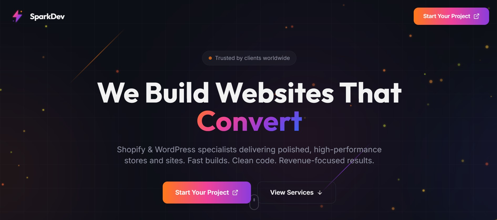
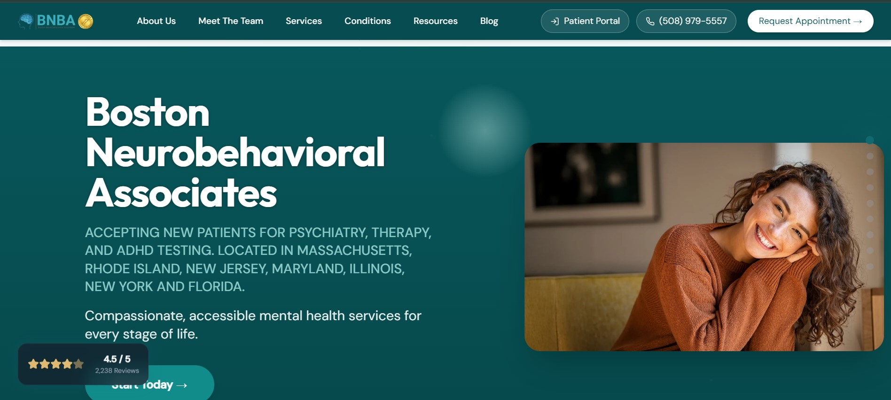

# Web Development Portfolio

This repository showcases a collection of modern web projects I’ve built, along with the tools, patterns, and engineering practices I commonly use when developing production-ready websites and web applications. The focus across all projects is consistent: clean UX, performance, scalability, and maintainable code.

---

## Selected Projects

### SparkDev – Conversion-Focused Agency Landing Page

A high-impact landing page built for a web development agency focused on conversion, clarity, and trust. The goal of this project was not just visual polish, but guiding visitors toward a single clear action with minimal friction.

The design emphasizes strong hierarchy, restrained motion, and confident messaging. Dark UI foundations are paired with subtle gradients and micro-interactions to create a premium feel without unnecessary noise. The layout is intentionally minimal, with performance and responsiveness treated as first-class requirements across devices.

---

### BNBA – Boston Neurobehavioral Associates Website Redesign

A full website redesign for Boston Neurobehavioral Associates, a large, established mental health provider operating across multiple states with a strong focus on adult psychiatry, ADHD services, and telepsychiatry.

This project required a disciplined, clinical tone without feeling cold or academic. The site is built to communicate trust, accessibility, and efficiency. Messaging prioritizes accurate diagnosis, patient-centered care, and streamlined access to treatment. The structure and UX are optimized for scale, responsiveness, and clarity, reflecting BNBA’s operational strengths: convenience, responsiveness, and effective medication management.

---

## Tools, Technologies, and Practices

I primarily work with a modern JavaScript-based stack, choosing tools based on performance, developer experience, and long-term maintainability.

### Frontend

- **React** for component-driven UI development
- **Next.js** for production-grade routing, rendering strategies, and performance
- **Vite** for fast local development and optimized builds
- **Framer Motion** for subtle, meaningful animations and interactions
- **shadcn/ui** for clean, accessible, and customizable UI components
- Responsive design with mobile-first layouts

### Backend & Data

- **Node.js** for backend services and APIs
- **Supabase** for authentication, databases, and real-time features
- **MongoDB** for flexible, scalable data models when appropriate
- RESTful and API-driven architectures

### Engineering Focus

- Performance optimization and fast load times
- Clear separation of concerns and reusable components
- Accessibility-conscious UI decisions
- Scalable project structure suitable for long-term growth
- Clean, readable code with maintainability in mind

---

## Contact

If you’d like to connect or discuss a project:

- **Email**: [ibrahim.m7004@gmail.com](mailto:ibrahim.m7004@gmail.com)
- **LinkedIn**: [linkedin.com/in/ibrahim-zm](https://www.linkedin.com/in/ibrahim-zm/)
